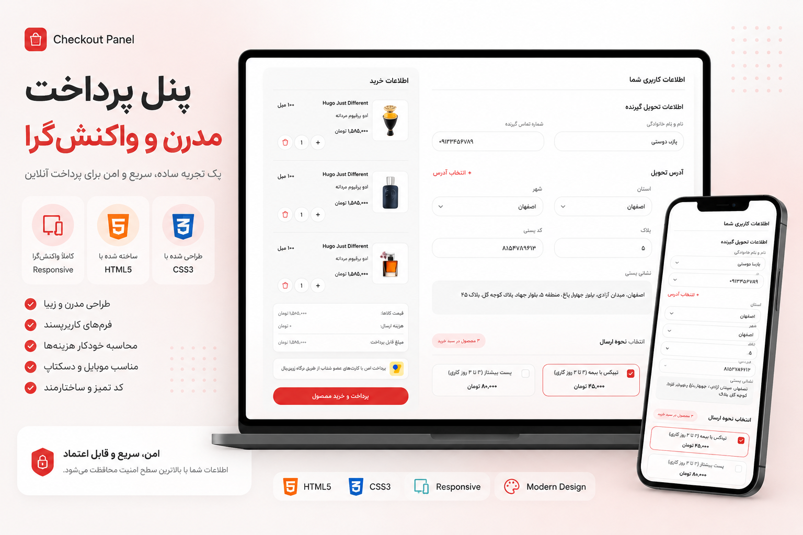

اما در README فقط ساختار فایل کافی نیست. برای Portfolio بهتر است این بخش‌ها را هم داشته باشی:

```md
# 🛒 Checkout Panel UI

A modern and responsive Checkout Panel user interface built with HTML5 and CSS3.

## 🚀 Live Demo

🔗 https://fatemeh-doosti.github.io/Checkout-Panel/

## 📸 Preview



## 🛠 Technologies Used

- HTML5
- CSS3
- Responsive Design
- BEM Methodology
- Custom Fonts

## 📁 Project Structure

```text
Checkout-Panel
│
├── 📄 index.html
├── 📄 preview.png
│
├── 📁 asset
│   ├── 📁 fonts
│   └── 📁 images
│
└── 📁 style
    ├── 📄 style.css
    └── 📄 font.css
